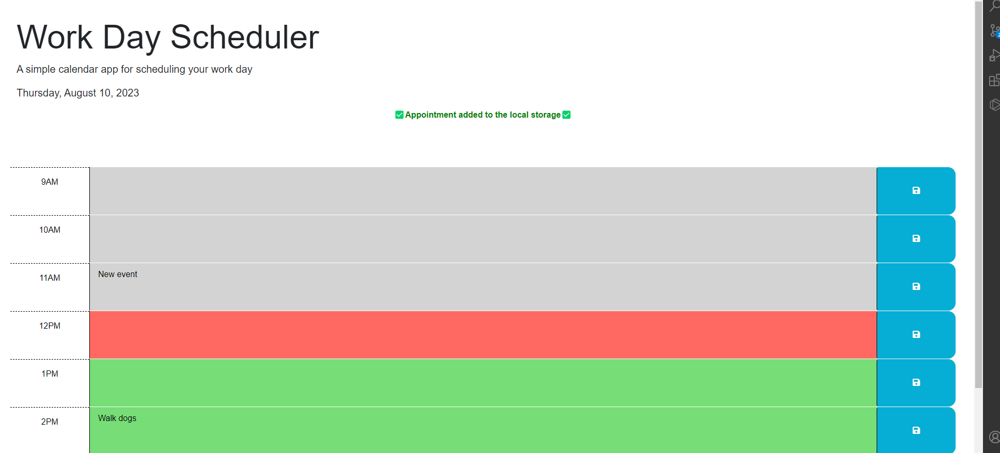

# Scheduler

A simple calendar app for scheduling your work day. This web application allows you to manage your tasks for different hours of the day. You can save your tasks and the app will indicate whether each task is in the past, present, or future based on the current time.

## Features

- Easily input and save tasks for different hours of the day.
- Dynamic coloring to differentiate past, present, and future tasks.
- Automatically persists tasks using Local Storage.
- Responsive design for various screen sizes.

## Usage

1. Open the [Work Day Scheduler](lrosa0126.github.io/Scheduler/).
2. The current date is displayed at the top of the page.
3. Each time block represents a different hour of the day.
--Gray being past / Red Current / Green Future
4. Input your task description in the textarea for each time block.
5. Click the "Save" button to save your task. A notification will confirm the change on the top of the screen.
7. Your tasks are automatically saved and retrieved using Local Storage.

## Technologies Used

- HTML
- CSS (Bootstrap)
- JavaScript (jQuery)

## Installation

1. Clone this repository to your local machine using:
2. Open the `index.html` file in a web browser.

## Contributing

Contributions are welcome! If you find any issues or improvements, feel free to create a pull request.

